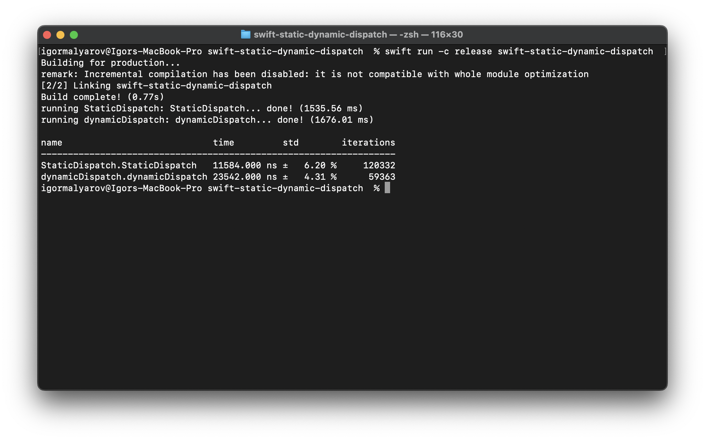

# Compare static and dynamic dispatch in Swift

Using `Benchmark` library by Google.

To see results switch to package folder in Terminal and run

```ch
$ swift run -c release swift-static-dynamic-dispatch
```


